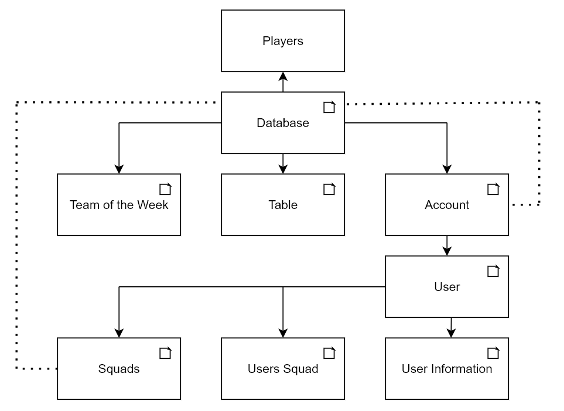
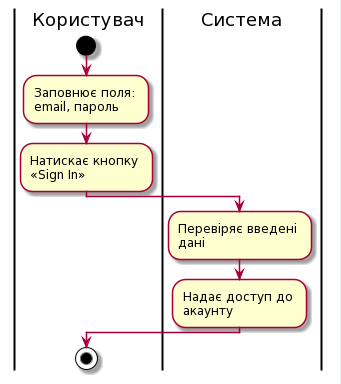
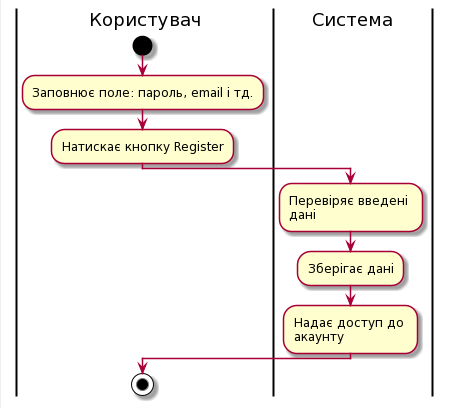
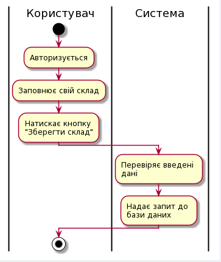
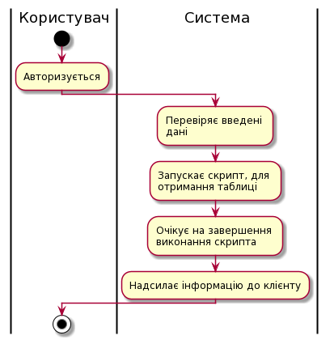
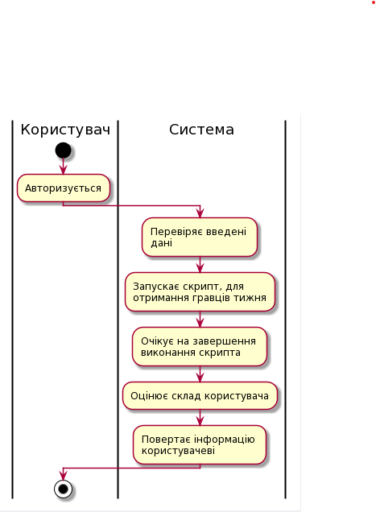

# Fantasy Football. Технічне завдання
### 1.Загальні відомості
- Назва проекту: Fantasy Football
- Дата початку розробки: 05.10.2021
### 2.Відомості про проект
- Проект заключається в створенні платформи, де футбольні фанати змагаються в створенні "команди тижня", базуючись на результатах Англійської Премьєр-Ліги. Кожного тижня (за виключенням пауз на матчі збірних) проходить новий тур чемпіонату, де кожен гравець, згідно власного перформансу, отримує відповідну оцінку (данні беруться з сайту WhoScore), і кожен тиждень користувач вибирає 11 гравців, які на його думку, в сумі отримають найвищу оцінку (на основі цього і відбувається змагання). Існуватиме таблиця лідерів серед користувачів, можливість обирати схему, користувачі можуть бачити склади інших користувачів. У списку футболістів будуть доступні всі, хто був заявлений командами на сезон 20/21.
### 3.Інструменти
- React
- Express
- MongoDB
# ER діаграма

# Зв'язки в MongoDB

# Специфікації прецедентів

### Авторизація користувача

***ID:*** UC.1.1

***НАЗВА:***  Авторизація користувача в системі.

***УЧАСНИКИ:***  Користувач, Система.

***ПЕРЕДУМОВИ:***  Існування облікового запису користувача.

***РЕЗУЛЬТАТ:***  Вхід користувача в обліковий запис.

***ВИКЛЮЧНІ СИТУАЦІЇ:***

•	EX.1.1. Відсутній обліковий запис користувача.

•	EX.1.2. Введено некоректну адресу електронної пошти.

•	EX.1.3. Введено некоректний пароль.

###### ДІАГРАМА СЦЕНАРІЮ:

---

### Реєстрація користувача

***ID:*** UC.1.2

***НАЗВА:***  Реєстрація користувача в системі.

***УЧАСНИКИ:***  Користувач, Система.

***ПЕРЕДУМОВИ:***  Відсутність облікового запису користувача.

***РЕЗУЛЬТАТ:***  Створення нового облікового запису користувача.

***ВИКЛЮЧНІ СИТУАЦІЇ:***

•	EX.2.1. Наявність облікового запису користувача у системі.

•	EX.2.2. Не задано пароль та/або адресу електронної пошти.

###### ДІАГРАМА СЦЕНАРІЮ:

---

### Зберігання мкладу

***ID:*** UC.1.3

***НАЗВА:***  Зберігання складу юзера

***УЧАСНИКИ:***  Користувач, Система.

***ПЕРЕДУМОВИ:***  Користувач авторизований у системі.

***РЕЗУЛЬТАТ:***  Склад збережений.

***ВИКЛЮЧНІ СИТУАЦІЇ:***

•	EX.3.1. Склад не був сформований користувачем.

###### ДІАГРАМА СЦЕНАРІЮ:

---

### Створення таблиці турніру

***ID:*** UC.1.4

***НАЗВА:***  Створення таблиці турніру.

***УЧАСНИКИ:***  Користувач, Система.

***ПЕРЕДУМОВИ:***  Користувач авторизований у системі.

***РЕЗУЛЬТАТ:***  Таблицю створену.

***ВИКЛЮЧНІ СИТУАЦІЇ:***

•	EX.4.1. Помилка в роботі серверу.

###### ДІАГРАМА СЦЕНАРІЮ:

---

### Створення команди тижня

***ID:*** UC.1.5

***НАЗВА:***  Створення команди тижня.

***УЧАСНИКИ:***  Користувач, Система.

***ПЕРЕДУМОВИ:***  Користувач авторизований у системі.

***РЕЗУЛЬТАТ:***  Команда сформована.

***ВИКЛЮЧНІ СИТУАЦІЇ:***

•	EX.5.1. Помилки в роботі серверу.

###### ДІАГРАМА СЦЕНАРІЮ:

